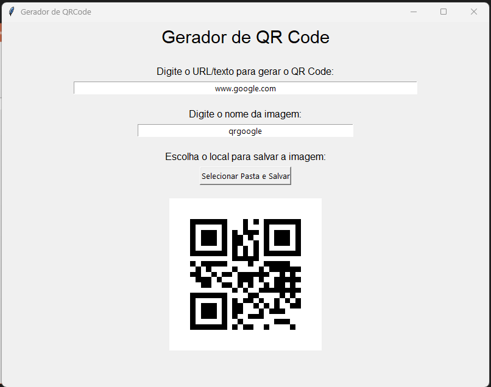

# gerador-qrcode

Este é um aplicativo simples em Python para gerar QR Codes a partir de textos ou URLs. O objetivo principal deste projeto é servir como um exercício para treinar meus conhecimentos em Programação Orientada a Objetos (POO).

Tecnologias Utilizadas

    - Python

    - Tkinter (Interface gráfica)

    - Pillow (Manipulação de imagens)

    - qrcode (Geração de QR Code)

Como Usar

    1. Execute o script Main.py

    2. Digite o texto ou URL que deseja converter para QR Code.

    3. Escolha um nome para o arquivo da imagem.

    4. Clique no botão "Selecionar Pasta e Salvar" para escolher um diretório e salvar o QR Code.

    5. O QR Code gerado será exibido na interface gráfica.

